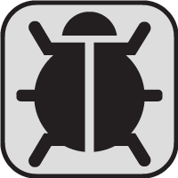

# react-native-drag-debugger

react-native component that let you see the console inside your app, in just one tap

## Demo


## Pre-Requirements

### react-native-console-panel
```sh
npm install --save react-native-console-panel
```
### react-native-flip-view
```sh
npm install git://github.com/Infinity0106/react-native-flip-view.git
```
### react-native-gesture-responder
```sh
npm i react-native-gesture-responder
```

## Installation
```sh
npm i react-debbuger
```

## Example 
```js
import DragDebuger from "react-native-drag-debugger.js";
...

render(){
		const routes = [
			{title: "First Scene", index: 0},
			{title: "Second Scene", index: 1},
		];
		return(
			<DragDebuger positionX={175} positionY={275} sourceIMG={this.image()}>
				<Navigator
					initialRoute={routes[0]}
					initialRouteStack={routes}
					renderScene={(route, navigator) =>
						<TouchableHighlight onPress={() => {
						if (route.index === 0) {
							navigator.push(routes[1]);
							console.log("inicio");
						} else {
							navigator.pop();
							console.log("final");
						}
						}}>
						<Text>Hello {route.title}!</Text>
						</TouchableHighlight>
					}
					style={{borderColor: "red",borderWidth:2, backgroundColor: "white"}}
					/>
			</DragDebuger>
		);
};
image(){
	return(<Image style={{width:50,height:50}} source={{uri:'http://hitchcock.itc.virginia.edu/Slavery/next.gif'}}/>);
};
```

## Props
|Prop		|Description							|Default					|
|-----------|---------------------------------------|---------------------------|
|`positionX`|initial X value for left positioning	| 0							|
|`positionY`|initial Y value for top positioning 	| 0							|
|`sourceIMG`|initial Image for the icon 			|	|


## Thanks To 
* [NativeSH](https://github.com/NativeSH/react-native-console-panel) (for the console panel)
* [kevinstumpf](https://github.com/kevinstumpf/react-native-flip-view) (for the flip view animation)
* [ldn0x7dc](https://github.com/ldn0x7dc/react-native-gesture-responder) (for the geesture responder)